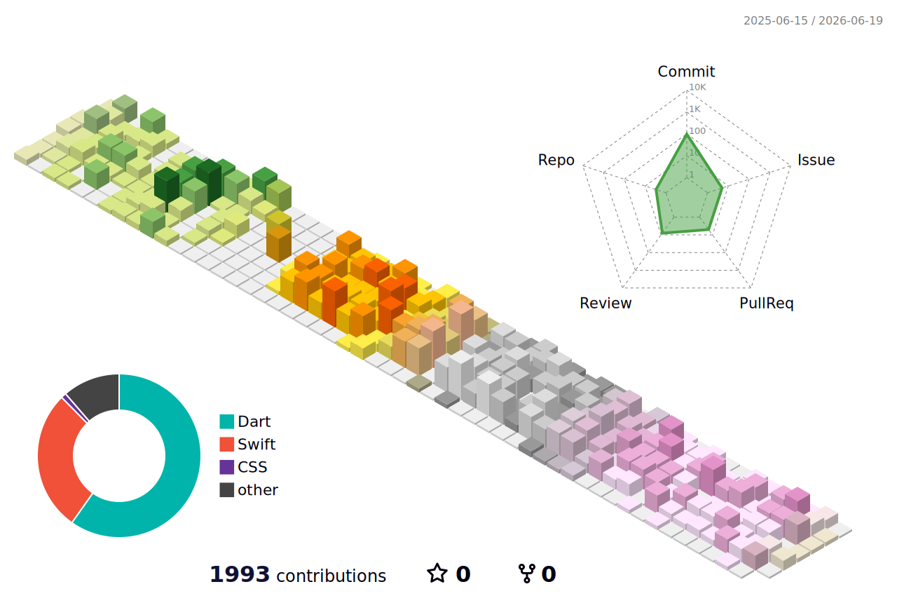

  <picture>
    <source media="(prefers-color-scheme: dark)" srcset="profile-3d-contrib/profile-night-rainbow.svg" width="700" />
    <source media="(prefers-color-scheme: light)" srcset="profile-3d-contrib/profile-season-animate.svg" width="700" />
    
  </picture>

